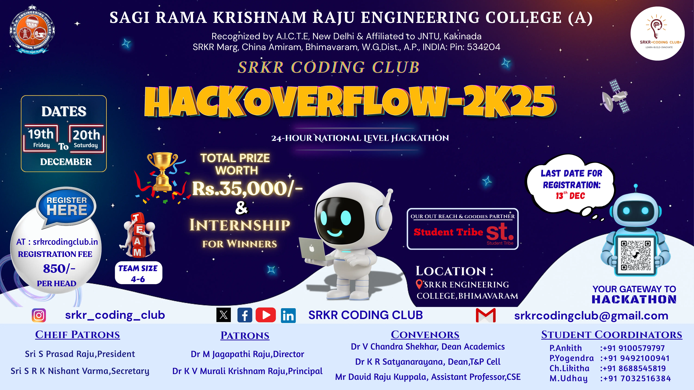
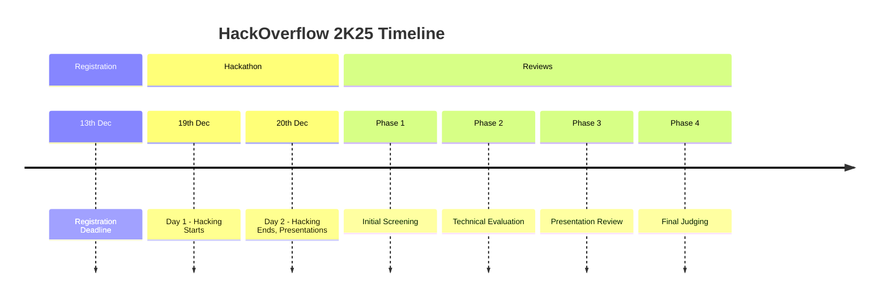

# HackOverflow 2K25

## Event Details

**Event Date:** 19th (Friday) – 20th (Saturday) December  
**Total Prize Pool:** Worth Rs. 35,000/-  
**Additional Benefit:** Internship opportunities for winners  
**Team Size:** 4–6 members  
**Registration Fee:** Rs. 850/- per head (750/- for affiliates)  
**Last Date for Registration:** 13th December  
**Venue:** SRKR Engineering College, Bhimavaram  
**Registration Link:** [srkrcodingclub.in](https://srkrcodingclub.in)  
**Contact:** srkrcodingclub@gmail.com

## Description

Welcome to HackOverflow, a prestigious platform for innovation, creativity, and collaboration. This event provides participants with a unique opportunity to demonstrate their skills, acquire new knowledge, and collaborate with peers to develop impactful solutions to real-world challenges.

HackOverflow is a competitive event where teams consisting of designers, developers, and subject matter experts come together to create innovative solutions within a defined timeframe. The primary objective is to inspire participants to think beyond conventional approaches and explore novel ideas that push the boundaries of technological possibilities.

Over the course of 24 hours, participants will engage in focused coding sessions aimed at developing functional prototypes that address critical business problems. Upon completion, each team will present their solutions to an esteemed panel of judges who will evaluate the prototypes based on creativity, functionality, and overall impact. This event provides a valuable platform for participants to showcase their abilities and demonstrate how their unique solutions can create real-world value.

In addition to competition, HackOverflow offers an enriching environment for learning, networking, and professional growth. Participants will have the opportunity to interact with industry experts, mentors, and fellow participants, fostering connections that extend beyond the event. This is an opportunity to gain insights, exchange knowledge, and enhance professional development.

## Prizes

1. Rs. 15,000/-  
2. Rs. 12,000/-  
3. Rs. 8,000/-  
4. & 5. TBA  

**Additional Benefits:** Certificates for all participants, Internship opportunities for top 3 teams (after screening)

## Guidelines

**Accommodation:** Participants from distant locations will be provided accommodation for one night, prior to the hackathon.

**Travel Options:** Bhimavaram Town Railway Station and Bhimavaram Bus Stand are the nearest travel hubs, offering convenient access to the venue.

**Certificates:** All participants will receive participation certificates via email after the event.

**Hardware:** Participants are encouraged to bring their own laptops and accessories. Computers will be available, but personal equipment is preferred to avoid technical issues.

**Internet Access:** Internet will be provided at the venue for participants during the event.

## Rules and Regulations

**Eligibility:** HackOverflow is open to students from engineering colleges, with teams formed from the same or different colleges.

**Team Size:** Teams must consist of 4 to 6 members.

**Team Membership:** Participants cannot be members of multiple teams.

**Multiple Registrations:** Multiple teams from the same college are allowed to register.

**Mode of Participation:** The event will be held offline.

**Submission Deadline:** All registrations must be completed by 13th December.

**Punctuality:** Teams must adhere to the event schedule.

**Evaluation:** Projects will be evaluated based on creativity, functionality, and impact. The jury's decisions are final.

**College ID Requirement:** A valid college ID is mandatory for attending the Hackathon and must be presented at the venue.

**Venue Access:** Only registered participants with valid IDs are allowed entry into the venue.

**Code of Conduct:** Teams must adhere to the event's code of conduct. Any violation may result in disqualification.

**Rule Modifications:** The organizing committee reserves the right to modify any rules. Participants will be notified of changes in advance.

## Judging Criteria

Projects will be evaluated based on the following criteria:

- **Creativity:** Originality of the idea, innovative approach to problem-solving, and uniqueness of the solution.
- **Functionality:** Technical implementation, usability, robustness, and completeness of the prototype.
- **Impact:** Potential real-world value, scalability, social or environmental benefits, and overall contribution to the problem domain.

The jury's decisions are final and binding.

## Event Schedule

## Themes

HackOverflow 2K25 features the following themes for project submissions:

- AI & Machine Learning
- Web3 & Blockchain
- Healthcare Technology
- Sustainable Development
- FinTech Innovation
- Education Technology
- IoT & Smart Devices
- Open Innovation

## Sponsors and Partners

- Student Tribe

## FAQs

What is the eligibility criteria for HackOverflow 2K25?

HackOverflow is open to students from engineering colleges. Teams can be formed from the same or different colleges.

What is the team size requirement?

Teams must consist of 4 to 6 members.

Can a participant be part of multiple teams?

No, participants cannot be members of multiple teams.

How much is the registration fee?

The registration fee is Rs. 850/- per head (Rs. 750/- for affiliates).

What is the last date for registration?

All registrations must be completed by 13th December.

Will accommodation be provided?

Yes, participants from distant locations will be provided accommodation for one night, prior to the hackathon.

What should participants bring?

Participants are encouraged to bring their own laptops and accessories. A valid college ID is mandatory.

How will projects be evaluated?

Projects will be evaluated based on creativity, functionality, and impact. The jury's decisions are final.

## About the Organizers

SRKR Coding Club is a student-led organization at SRKR Engineering College dedicated to fostering a coding culture, organizing technical events, and promoting innovation and collaboration among students. We aim to bridge the gap between academia and industry through workshops, hackathons, and networking opportunities.

## Contact Details

For inquiries, please contact:

- Phone: +91 99665 42463, +91 90321 49776
- Email: srkrcodingclub@gmail.com
